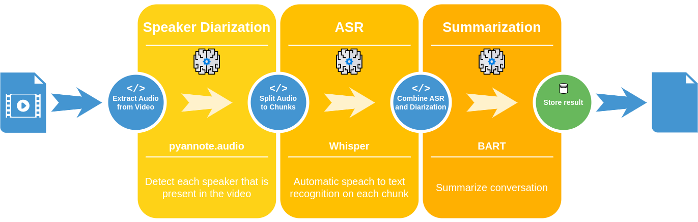

# Speech Condenser

Speech condenser is a tool for reducing the size of a dialogue.

## Pipeline

It combines several tools to achieve the goal of reducing the size of a dialogue. Each step of the above pipleine runs inside a container.

Steps:

1. Audio extraction - Extracts the audio from the video file.
2. Speaker diarization - Identifies the speakers in the audio file.
3. Split audio - Splits the audio file into smaller chunks based on the speaker diarization.
4. Speech to text - Transcribes the audio chunks into text.
5. Combine ASR and diarization - Combines the results of the ASR and diarization to get the text for each speaker as a dialogue.
6. Summarization - Summarizes the dialogue.

## Installation and Usage

The setup uses docker or podman to run the containers. A set of local scripts are provided to run the pipeline.

* build.sh - Builds the containers.
* pipeline.sh - Runs the pipeline.

Videos needs to be provided in the `data/input` directory. The output will be in the `data/output` directory. Optionally the `youtbe.sh` script can be used to download videos from youtube.

## Components 

* https://github.com/pyannote/pyannote-audio
* https://github.com/openai/whisper
* https://huggingface.co/philschmid/bart-large-cnn-samsum
