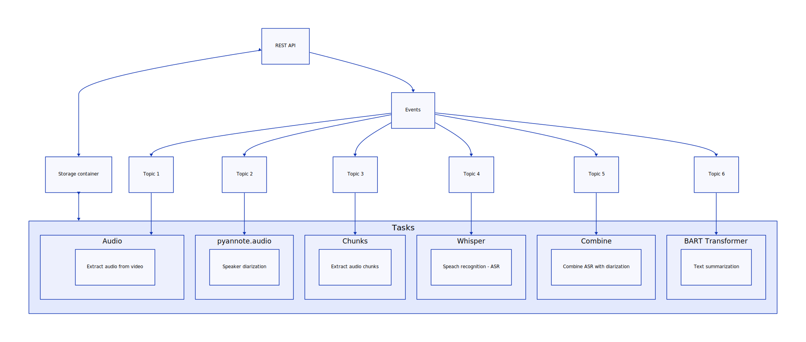

# Speach Condenser

Speach condenser is a tool for reducing the size of a dialogue.

## Pipeline



The diagram is generated using [d2](https://github.com/terrastruct/d2) and can be updated by running the following command:

```
d2 -w ./docs/pipeline/input.d2 ./docs/pipeline/output.svg
```

## Installation

TBD

## Usage

TBD

## Components 

* https://github.com/pyannote/pyannote-audio
* https://github.com/openai/whisper
* https://huggingface.co/philschmid/bart-large-cnn-samsum
